# Quick News App by David Kang

The purpose of this application was not to simply create an application, but to practice and explore uses of Kotlin and RxJava.  The application itself is not very exciting, but learning a new technologies was.

The Quick News App is a mobile client for the [News API by Google](https://newsapi.org/). 

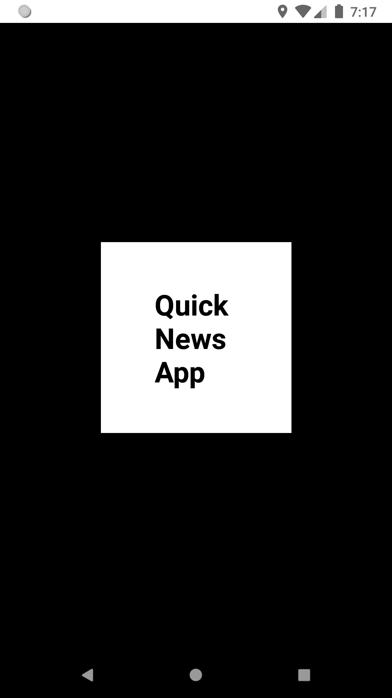

Articles are divided by different categories such as `Business`, `Health`, `Entertainment`, and a few more.

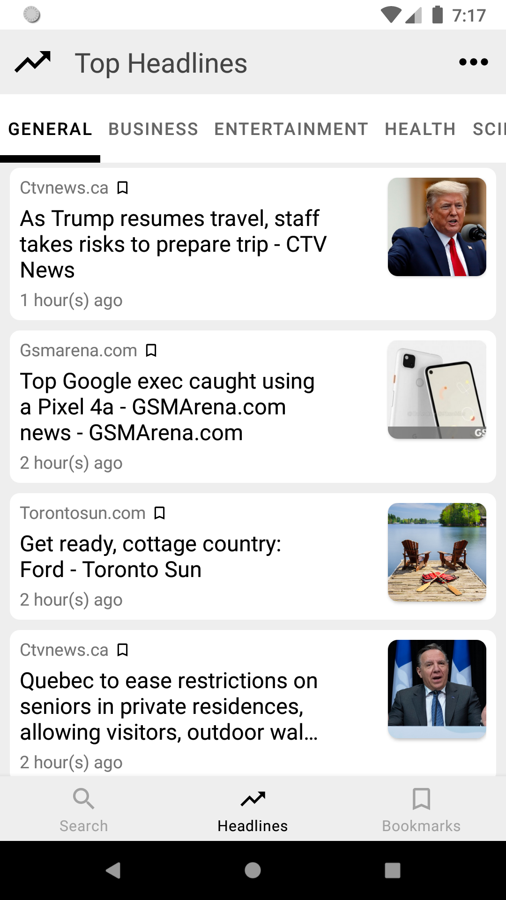

Tapping on the `Search` item in the navigation at the bottom, users may search for keywords to find articles relevant to them or select a previous search they have already made.  The user can also remove certain searches or remove them all.

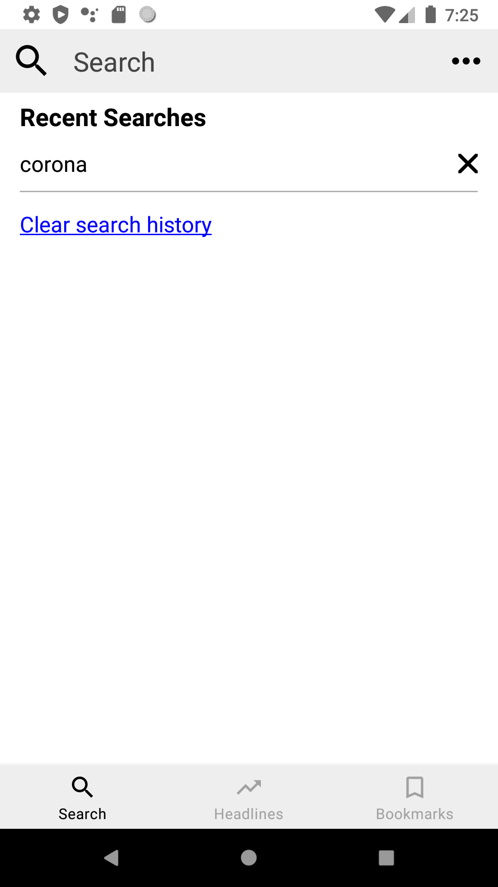
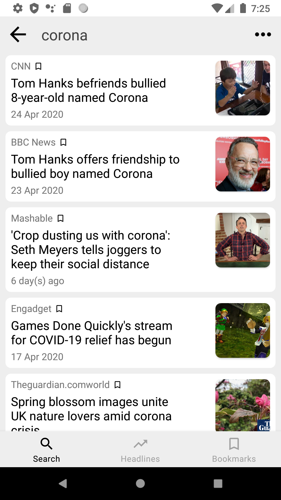

**This application does not display the news articles and its content directly, but will direct the user to the web page that the article is hosted on.**

By a single tap on an article, the user will be prompted to open a link to the article.  Tapping on `Open Link`, the user will be directed to the web page.

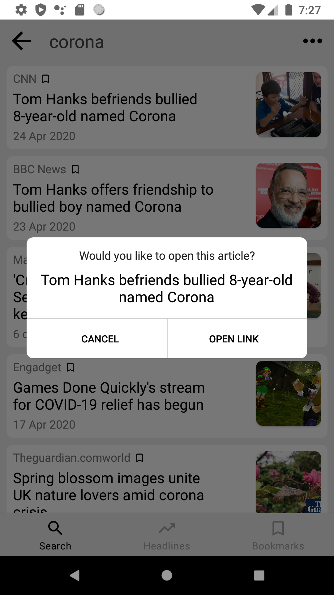
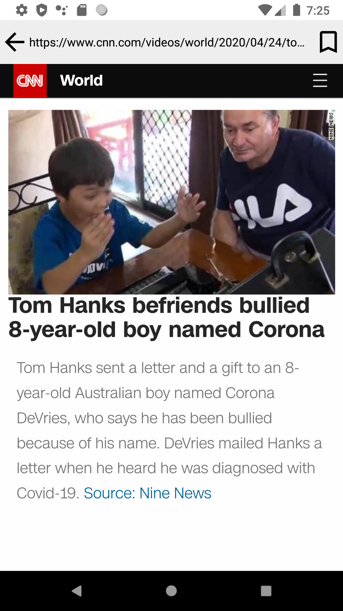

On a long tap/hold on an article, the user will have the option to bookmark an article, for viewing later.

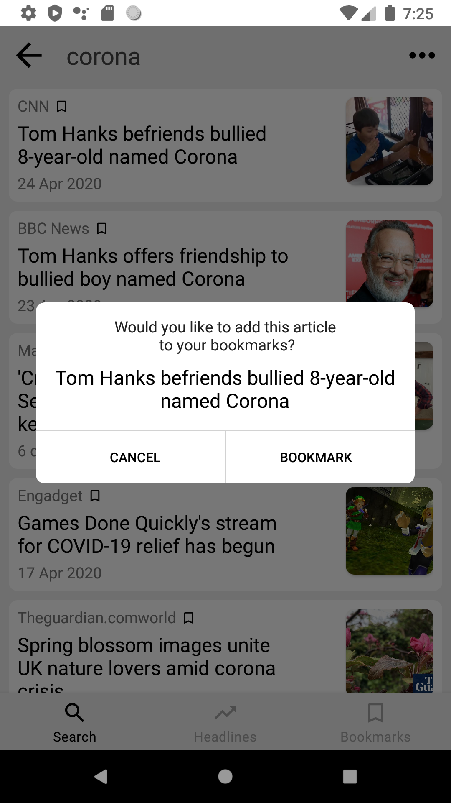

Users may view this bookmarked article in the `Bookmarks` section, which can be viewed by tapping on the right icon in the bottom navigation.

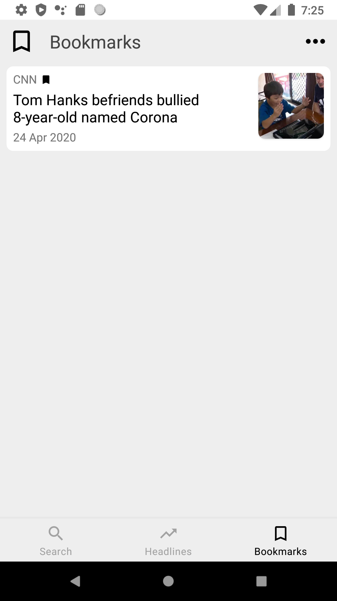

Additional pages can be reached by tapping on the button on the top right corner, and selecting a page in the prompt.

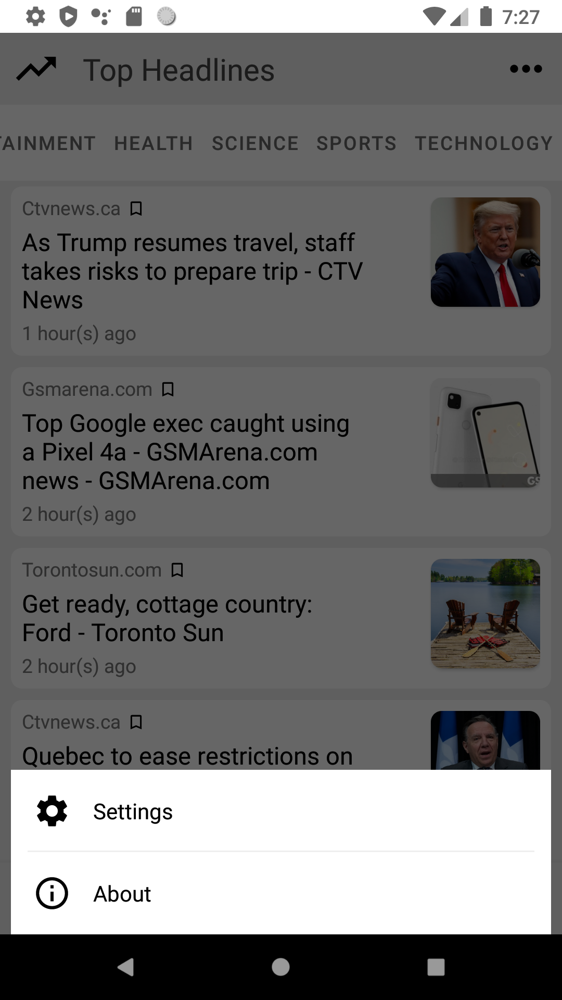

Tapping on the `Settings` section will display options that the user can choose from to customize their app experience.  A user should be able to select a country that they want to view their top headlines from (Incomplete).

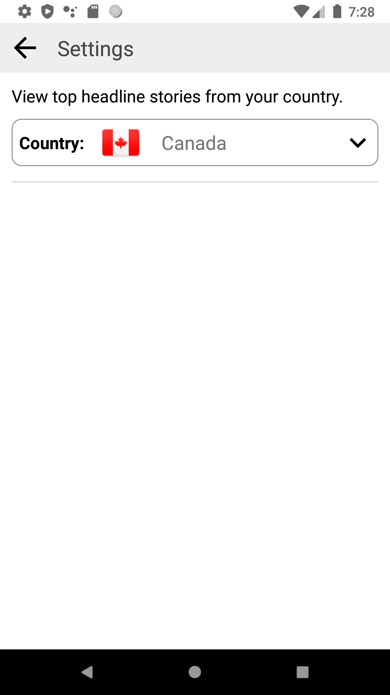
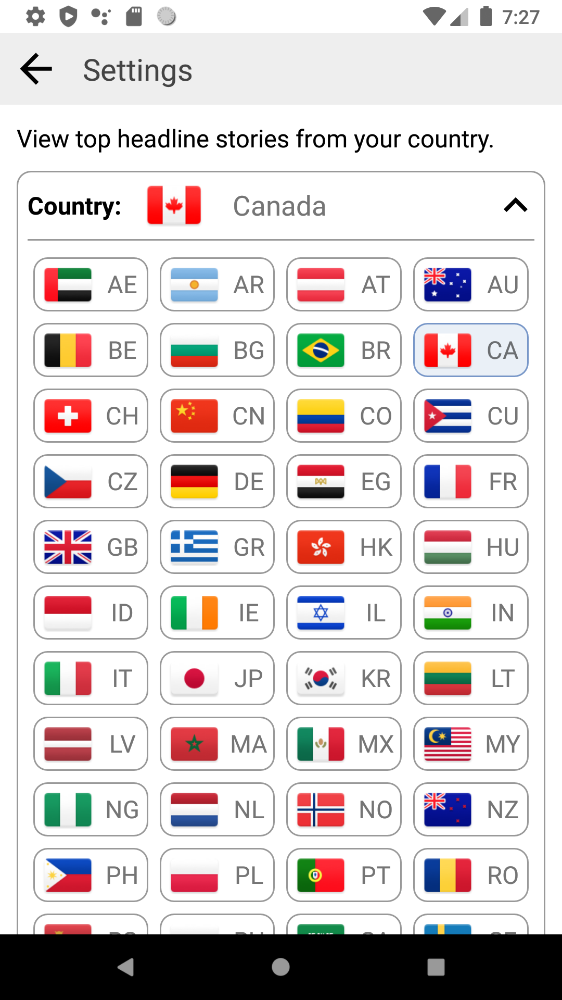

Tapping on the `About` section will display a short message about the app.

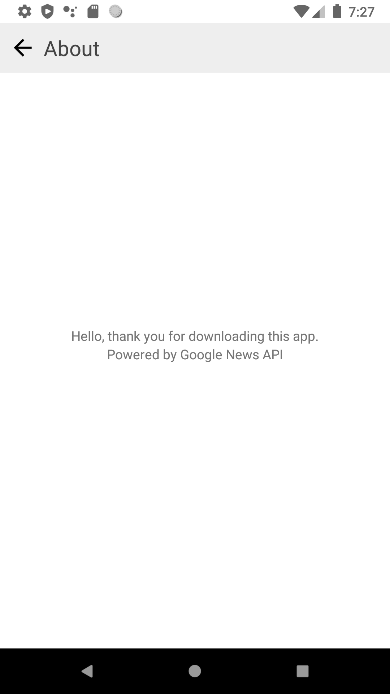
